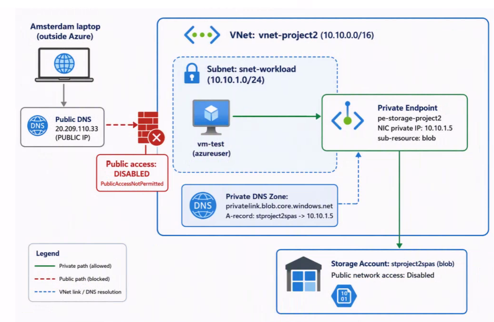

# 🔐 Project 2 — Secured Azure Storage Account with Private Endpoint

Lock down an Azure Storage account so it is **unreachable from the public internet** and can only be accessed **privately from within a virtual network** via an Azure **Private Endpoint** + **Private DNS Zone**.

> Part of my hands-on **AZ-104** portfolio. Built **portal-first** to learn the concepts, then reproduced as **Infrastructure as Code (Bicep)**.

---

## 🎯 What this project demonstrates

- Disabling **public network access** on a PaaS storage account
- Connecting to Blob storage privately through a **Private Endpoint** (a NIC with a private IP inside a subnet)
- Wiring up a **Private DNS Zone** (`privatelink.blob.core.windows.net`) so the storage name resolves to the **private IP**
- Proving the difference between **network reachability** and **data authorization**
- Bonus storage governance: **blob versioning** + **lifecycle management**

---

## 🗺️ Architecture



---

## 🧩 Core concepts (the mental model)

| Concept | Everyday analogy | What it really is |
|---|---|---|
| **Storage account** | A warehouse | Where blobs/files live; has a public address by default |
| **Public endpoint** | Warehouse on a public street | The default `*.blob.core.windows.net` URL, reachable from the internet |
| **Private endpoint** | A private hallway from your office to the warehouse | A NIC **inside your subnet** with a **private IP** connected to the storage account |
| **Private DNS zone** | An updated address book | Rewrites the storage name so it resolves to the **private IP** instead of the public one |
| **Public network access = Disabled** | Bricking up the public door | Blocks all internet traffic; only the private endpoint works |

> **Golden rule:** A private endpoint is useless without a **private DNS zone**. The endpoint gives a private IP; the DNS zone makes the storage *name* resolve to that IP.

---

## 🛠️ Build steps (portal-first)

| Step | What I did | Key setting |
|---|---|---|
| 1 | Created resource group | `rg-storage-project2` (West Europe) |
| 2 | Created VNet + subnet + test VM | `vnet-project2` `10.10.0.0/16`, `snet-workload` `10.10.1.0/24`, `vm-test` |
| 3 | Created storage account + a container | `stproject2spas`, container `data`, LRS |
| 4 | Added a private endpoint | `pe-storage-project2`, target sub-resource **blob**, auto-created private DNS zone |
| 5 | Disabled public network access | Networking → Public network access = **Disabled** |
| 6 | Proved private resolution | `nslookup` from VM returns **private IP**; laptop returns **public IP** |
| 7 | Added storage governance | Blob **versioning** + **lifecycle management** rule |
| 8 | Documented it | This README + screenshots |

---

## 🔬 Proof it works

### DNS resolution — inside the VNet vs. outside

**From `vm-test` (inside the VNet):**
```
> nslookup stproject2spas.blob.core.windows.net
Server:   UnKnown
Address:  168.63.129.16          <- Azure-provided DNS (same magic IP in every VNet)

Non-authoritative answer:
Name:     stproject2spas.privatelink.blob.core.windows.net
Address:  10.10.1.5              <- ✅ PRIVATE IP (the private endpoint NIC)
Aliases:  stproject2spas.blob.core.windows.net
```

**From my laptop in Amsterdam (outside Azure):**
```
> nslookup stproject2spas.blob.core.windows.net
Server:   UnKnown
Address:  192.168.0.1            <- home router DNS

Non-authoritative answer:
Name:     blob.lvl08prdstr10a.store.core.windows.net
Address:  20.209.110.33          <- PUBLIC IP (shared front end)
Aliases:  stproject2spas.blob.core.windows.net
          stproject2spas.privatelink.blob.core.windows.net
```

> **Same name, two answers:** private IP inside the VNet, public IP outside. Azure DNS resolves the `privatelink` zone **only for machines in the VNet**.

📸 _Screenshot: `screenshots/06-dns-vm-vs-laptop.png`_

### The "two gates" lesson (network vs. authorization)

Browsing the blob URL from the VM returned:
```xml
<Error>
  <Code>PublicAccessNotPermitted</Code>
  <Message>Public access is not permitted on this storage account</Message>
</Error>
```

This is **not** a network failure — it's proof the request **reached** the storage account over the private endpoint and got a *reply*. A blocked network path gives a **timeout**, not a formatted XML error. The XML error means the **network gate passed**, but the **authorization gate** stopped an anonymous (no key/SAS/Entra) browser request.

| Gate | Question | Blocked result |
|---|---|---|
| **Network** (firewall / private endpoint) | "Are you on an allowed network path?" | Timeout / connection reset |
| **Authorization** (anonymous / SAS / RBAC) | "Are you allowed to read this data?" | **XML `<Error>`** from the service |

To access data successfully, reach the blob **with credentials** (SAS token, Storage Explorer, or AzCopy) — not a plain browser URL.

📸 _Screenshot: `screenshots/06b-publicaccessnotpermitted.png`_

---

## 🎓 AZ-104 skills demonstrated

- **Configure access to storage** → Configure Azure Storage firewalls and virtual networks
- **Implement and manage virtual networking** → Configure **private endpoints** for Azure PaaS
- **Configure name resolution** → Azure DNS / Private DNS zones
- **Configure Azure Files and Azure Blob Storage** → blob **versioning**, blob **lifecycle management**

---

## 🧠 Exam memory hooks

- **Private endpoint = reachability. SAS/RBAC/anonymous = permission.**
- **Timeout = network blocked. XML `<Error>` = network OK, authorization blocked.**
- **Private endpoint needs a private DNS zone**, or the name still resolves to the public IP.
- **One private endpoint per sub-resource** (blob, file, queue, table each need their own).
- **Redundancy ladder:** LRS → ZRS → GRS → GZRS (more letters = more resilience = more cost).
- **Versioning protects, lifecycle economizes.**

---

## 📦 Infrastructure as Code (Bicep)

See bicep/main.bicep for the IaC version. It shows a clean dependency chain:

```
storage account
   └── private endpoint
         └── private DNS zone
               └── DNS zone group (A-record wiring)
   + publicNetworkAccess: 'Disabled'
```

**Deploy:**
```bash
az group create --name rg-storage-project2 --location westeurope
az deployment group create \
  --resource-group rg-storage-project2 \
  --template-file bicep/main.bicep
```

---

## 🗂️ Repo structure

```
Project2-SecuredStorage/
├── README.md
├── bicep/
│   └── main.bicep
└── screenshots/
    ├── 06-dns-vm-vs-laptop.png
    └── 06b-publicaccessnotpermitted.png
```

---

## 🧹 Cleanup

```bash
az group delete --name rg-storage-project2 --yes --no-wait
```
